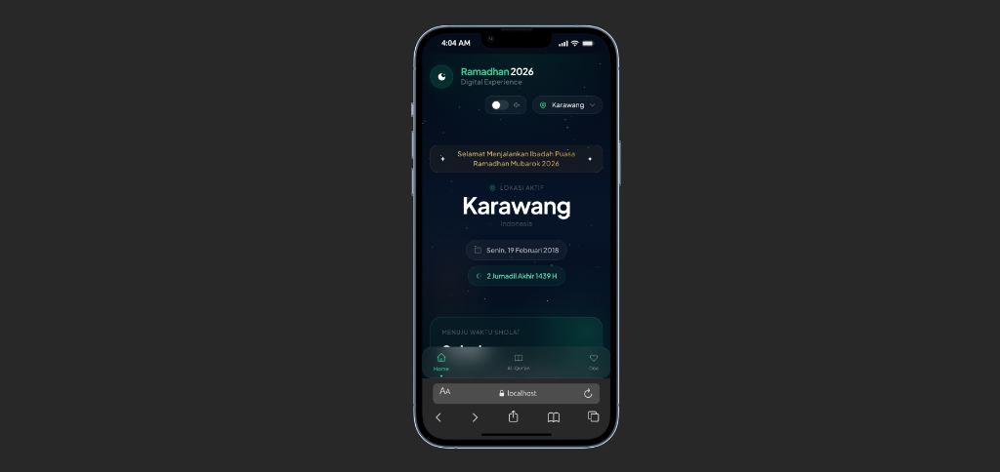
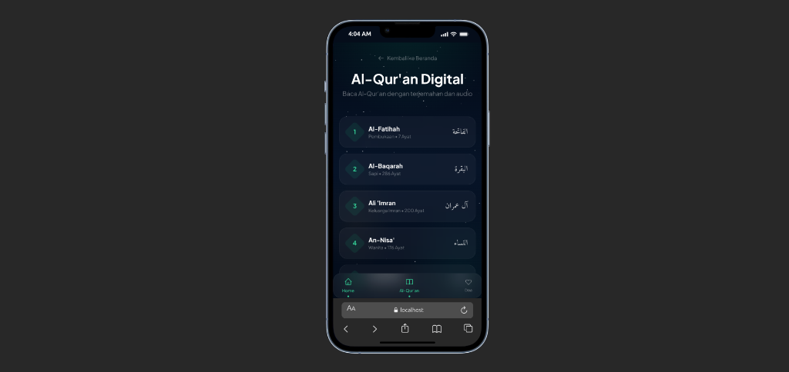
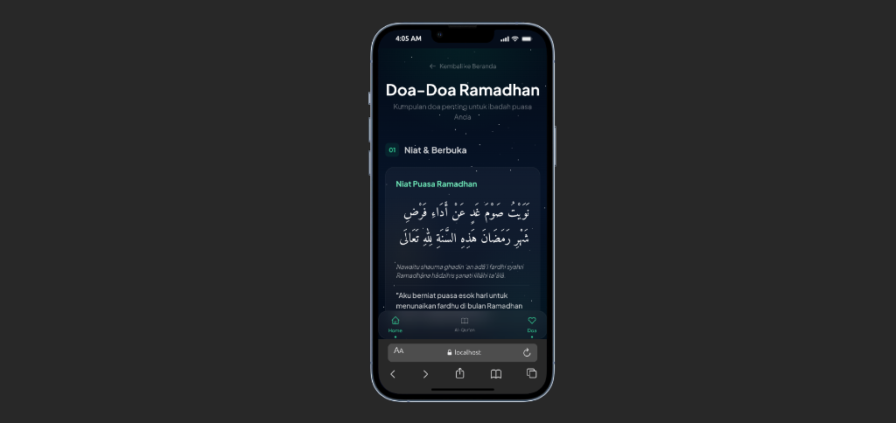

# Ramadhan 2026 - Digital Experience 🌙

Project website Ramadhan modern dengan fitur lengkap Jadwal Sholat, Al-Quran, dan Countdown, dibuat dengan Next.js 14, Tailwind CSS, dan TypeScript.eknologi web terbaru untuk pengalaman pengguna yang cepat, responsif, dan estetik.

## Fitur Utama 

- **Jadwal Sholat & Imsakiyah**: Akurat sesuai lokasi (Default: Karawang), menggunakan API Aladhan (Kemenag RI).
- **Al-Qur'an Digital**: Baca Al-Qur'an per surat dengan tampilan nyaman.
- **Murotal Audio Player**: Dengarkan lantunan ayat suci dari Mishary Rashid Alafasy (sumber: EveryAyah).
- **Auto Focus Ayat**: Layar otomatis bergulir mengikuti ayat yang sedang diputar.

## Galeri Aplikasi 📱

  
  
  

## Teknologi 

- **Framework**: [Next.js 14](https://nextjs.org/) (App Router)
- **Bahasa**: [TypeScript](https://www.typescriptlang.org/)
- **Styling**: [Tailwind CSS](https://tailwindcss.com/)
- **Animasi**: CSS Animations & Transitions
- **Deployment**: [Vercel](https://vercel.com/)
---
*Dibuat dengan ❤️ untuk menyambut Ramadhan 1447 H.*
